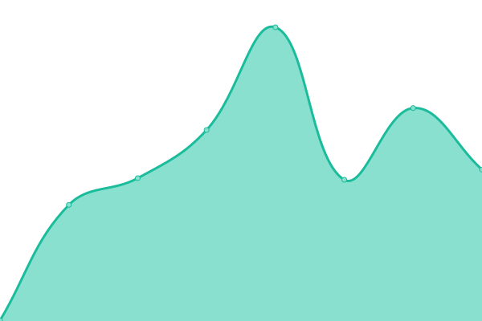

# [📈 Live Status](https://flynnd6.github.io/nda-stats): <!--live status--> **🟩 All systems operational**

This repository contains the open-source uptime monitor and status page for [Declan Flynn](https://flynnd6.github.io/nda-stats), powered by [Upptime](https://github.com/upptime/upptime).

With [Upptime](https://upptime.js.org), you can get your own unlimited and free uptime monitor and status page, powered entirely by a GitHub repository. We use [Issues](https://github.com/flynnd6/nda-stats/issues) as incident reports, [Actions](https://github.com/flynnd6/nda-stats/actions) as uptime monitors, and [Pages](https://flynnd6.github.io/nda-stats) for the status page.

<!--start: status pages-->
<!-- This summary is generated by Upptime (https://github.com/upptime/upptime) -->
<!-- Do not edit this manually, your changes will be overwritten -->
<!-- prettier-ignore -->
| URL | Status | History | Response Time | Uptime |
| --- | ------ | ------- | ------------- | ------ |
|  [New Dimensions Active](https://newdimensionsactive.ie) | 🟩 Up | [new-dimensions-active.yml](https://github.com/flynnd6/Monitoring/commits/HEAD/history/new-dimensions-active.yml) | 

 2438ms
     
 | 

<a href="https://flynnd6.github.io/monitoring/history/new-dimensions-active">100.00%</a>
    

|  [New Dimensions Active CDN](https://cdn.newdimensionsactive.ie/wp-content/uploads/2018/11/trs-white.png) | 🟩 Up | [new-dimensions-active-cdn.yml](https://github.com/flynnd6/Monitoring/commits/HEAD/history/new-dimensions-active-cdn.yml) | 

 251ms
     
 | 

<a href="https://flynnd6.github.io/monitoring/history/new-dimensions-active-cdn">100.00%</a>
    

<!--end: status pages-->

[**Visit our status website →**](https://flynnd6.github.io/monitoring)

## 📄 License

- Powered by: [Upptime](https://github.com/upptime/upptime)
- Code: [MIT](./LICENSE) © [Declan Flynn](https://flynnd6.github.io/nda-stats)
- Data in the `./history` directory: [Open Database License](https://opendatacommons.org/licenses/odbl/1-0/)
